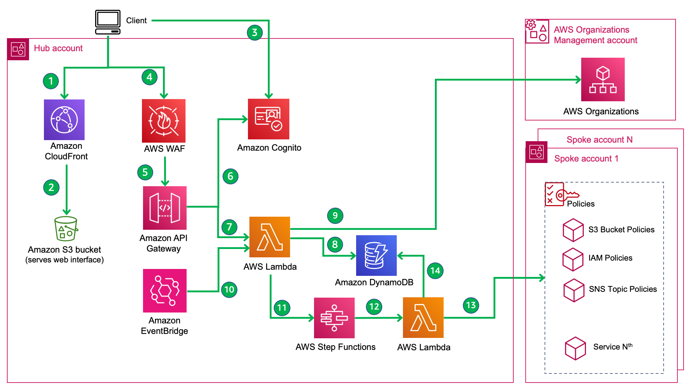

# Account Assessment for AWS Organizations

Account Assessment for AWS Organizations programmatically scans all AWS accounts in an AWS Organization for
identity-based and resource-based policies with Organization-based conditions.

**[🚀Solution Landing Page](https://aws.amazon.com/solutions/implementations/account-assessment-for-aws-organizations)**

**[](https://codecatalyst.aws/launch?options=%7B%22sourceRepository%22%3A%22https%3A%2F%2Fgithub.com%2Ftbelmega%2Faccount-assessment-for-aws-organizations%22%2C%22destinationRepositoryName%22%3A%22account-assessment-for-aws-organizations%22%2C%22parameters%22%3A%5B%7B%22key%22%3A%22region%22%2C%22value%22%3A%22us-west-2%22%2C%22possibleValues%22%3A%5B%22us-west-2%22%2C%22eu-west-1%22%5D%2C%22displayComponent%22%3A%22dropdown%22%2C%22displayName%22%3A%22Hub%20deployment%20region%22%7D%2C%7B%22key%22%3A%22DIST_OUTPUT_BUCKET%22%2C%22value%22%3A%22account-assessment-staging%22%2C%22displayName%22%3A%22Staging%20bucket%20name%22%2C%22displayDescription%22%3A%22Must%20be%20globally%20unique%22%2C%22defaultEntropy%22%3A8%7D%2C%7B%22key%22%3A%22version%22%2C%22value%22%3A%22custom001%22%2C%22displayName%22%3A%22Solution%20version%22%7D%2C%7B%22key%22%3A%22namespace%22%2C%22value%22%3A%22aa%22%2C%22displayName%22%3A%22Deployment%20namespace%20(Prefix%20for%20resource%20names)%22%2C%22defaultEntropy%22%3A8%7D%2C%7B%22key%22%3A%22prefix%22%2C%22value%22%3A%22%22%2C%22displayName%22%3A%22Cognito%20hosted%20UI%20url%20prefix%22%2C%22displayDescription%22%3A%22Must%20be%20globally%20unique%22%2C%22defaultEntropy%22%3A8%7D%2C%7B%22key%22%3A%22email%22%2C%22value%22%3A%22%22%2C%22optional%22%3Afalse%2C%22displayName%22%3A%22Administrator%20email%22%2C%22displayDescription%22%3A%22Receives%20credentials%20to%20solution%20web%20UI%22%7D%2C%7B%22key%22%3A%22IP_RANGES%22%2C%22value%22%3A%220.0.0.0%2F1%2C128.0.0.0%2F1%22%2C%22displayName%22%3A%22Allowed%20IP%20Ranges%22%2C%22displayDescription%22%3A%22Web%20Application%20Firewall%20configuration%20for%20access%20to%20the%20solution%20API%22%2C%22defaultEntropy%22%3A8%7D%2C%7B%22key%22%3A%22ORG_ID%22%2C%22value%22%3A%22%22%2C%22optional%22%3Afalse%2C%22displayName%22%3A%22Organization%20ID%22%2C%22placeholderText%22%3A%22o-a1b2c3d4e5%22%2C%22displayDescription%22%3A%22Receives%20credentials%20to%20solution%20web%20UI%22%7D%2C%7B%22key%22%3A%22MANAGEMENT_ACCOUNT_ID%22%2C%22value%22%3A%22%22%2C%22optional%22%3Afalse%2C%22displayName%22%3A%22Organization%20management%20account%20ID%22%2C%22placeholderText%22%3A%22123456789012%22%7D%2C%7B%22key%22%3A%22HUB_ACCOUNT_ID%22%2C%22value%22%3A%22%22%2C%22optional%22%3Afalse%2C%22displayName%22%3A%22Hub%20account%20ID%22%2C%22displayDescription%22%3A%22Account%20ID%20where%20the%20hub%20stack%20is%20deployed%22%2C%22placeholderText%22%3A%22123456789012%22%7D%2C%7B%22key%22%3A%22ORG_UNITS%22%2C%22value%22%3A%22%22%2C%22optional%22%3Afalse%2C%22displayName%22%3A%22Organizational%20units%20to%20scan%22%2C%22displayDescription%22%3A%22Solution%20spoke%20stack%20will%20deployed%20to%20all%20accounts%20in%20the%20given%20org%20units.%22%2C%22placeholderText%22%3A%22ou-aaaa-bbbbbbbb%2Cou-cccc-dddddddd%22%7D%2C%7B%22key%22%3A%22SCAN_REGIONS%22%2C%22value%22%3A%22%22%2C%22optional%22%3Afalse%2C%22displayName%22%3A%22Regions%20to%20scan%22%2C%22displayDescription%22%3A%22Solution%20spoke%20stack%20will%20deployed%20to%20the%20given%20regions.%22%2C%22placeholderText%22%3A%22us-east-1%20us-west-2%22%7D%5D%2C%22environments%22%3A%5B%7B%22name%22%3A%22hub-account%22%2C%22environmentType%22%3A%22PRODUCTION%22%7D%2C%7B%22name%22%3A%22orgmgmt-account%22%2C%22environmentType%22%3A%22PRODUCTION%22%7D%5D%7D)**

_Note:_ For any relevant information outside the scope of this readme, please refer to the solution landing page and
implementation guide.

## Table of content

- [Solution Overview](#solution-overview)
- [Architecture](#architecture)
- [Installation](#installing-pre-packaged-solution-template)
- [Customization](#customization)
  - [Setup](#setup)
  - [File Structure](#file-structure)
  - [Unit Test](#unit-test)
  - [Build](#build)
  - [Deploy](#deploy)
  - [Faster development cycles](#faster-development-cycles)
- [License](#License)

## Solution Overview

## Architecture

The default deployment of solution pre-packaged template deploys following infrastructure in your account.



## Installing pre-packaged solution template

#### Parameters

***

## Customization

### Setup

- Python Prerequisite: python=3.9 | pip3=21.3.1
- Javascript Prerequisite: node=v18.10.0 | npm=8.19.2

Clone the repository and make desired code changes.

```
git clone aws-solutions/account-assessment-for-aws-organizations
```

_Note: Following steps have been tested under above pre-requisites_

### File Structure

```
├── deployment/                             - contains build scripts, deployment templates, and dist folders for staging assets.
  ├── cdk-solution-helper/                  - helper function for converting CDK output to a format compatible with the AWS Solutions pipelines.
  ├── build-open-source-dist.sh             - builds the open source package with cleaned assets and builds a .zip file in the /open-source folder for distribution to GitHub
  ├── build-s3-dist.sh                      - builds the solution and copies artifacts to the appropriate /global-s3-assets or /regional-s3-assets folders.
  ├── build-lambdas.sh                      - builds and packages the lambda code only
├── source/   
  ├── account-assessment-solution.ts        - the CDK app that wraps your solution.
  ├── infra/                                - the source code for the infrastructure-as-code AWS CDK project
     ├── bin
       └──  account-assessment-solution.ts     - the CDK app for your solution.
     ├── lib
       ├── account-assessment-hub-stack.ts    - the hub CDK stack.
       ├── account-assessment-spoke-stack.ts  - the spoke CDK stack.
       ├── app-register.ts                    - integrates Hub and Spoke stacks with AppRegistry
       ├──org-management-account-stack.ts     - the AWS Organizations Management CDK stack.
       └── components                         - hub stack resources grouped into constructs for better maintainability 
         ├── api.ts                            - resources related to API Gateway
         ├── cognito-authenticator.ts          - resources related to authentication
         ├── job-history-component.ts          - DynamoDB table and Lambda functions related to the job management microservice
         ├── resource-based-policy-component.ts - Lambda functions related to the resouce based policy microservice
         ├── resource-based-policy-state-machine.ts - custom resource to deploy solution WebUI to S3
         ├── simple-assessment-component.ts    - generic set of DynamoDB table and Lambda functions for all microservices.
         ├── web-ui-deployer.ts                - custom resource to deploy solution WebUI to S3
         └── web-ui-hosting.ts                 - resources to host the web ui in S3
     └── test/
        └── __snapshots__/
├── cdk-solution-test.ts                    - example unit and snapshot tests for CDK project.
  ├── cdk.json                              - config file for CDK.
  ├── package.json                          - package file for the CDK project.
  ├── README.md                             - doc file for the CDK project.
  ├── lambda/                               - the source code for the solution's lambda functions
    ├── requirements.txt
    ├── testing_requirements.txt            - python test dependency file
    ├── assessment_runner/                  - job management microservice
    ├── aws/
    ├── services                            - low-level clients to interact with AWS Services
        └── utils/
    ├── delegated_admins/                   - delegated admin scan microservice
    ├── deploy_webui/                       - lambda-backed custom resource to deploy solution WebUI to S3
    ├── resource_based_policy/              - IAM policies scan microservice
        ├── step_functions_lambda/
        └── supported_configuration/
    ├── tests/
    ├── trusted_access_enabled_services/    - Trusted AWS Services scan microservice
    └── utils/
  ├── webui                                 - react app that serves as user interface for this solution
  ├── run-all-tests.sh                      - runs all tests within the /source folder. Referenced in the buildspec and build scripts.
├── .gitignore
├── .viperlightignore                       - Viperlight scan ignore configuration  (accepts file, path, or line item).
├── .viperlightrc                           - Viperlight scan configuration.
├── buildspec.yml                           - main build specification for CodeBuild to perform builds and execute unit tests.
├── CHANGELOG.md                            - required for every solution to include changes based on version to auto-build release notes.
├── CODE_OF_CONDUCT.md                      - standardized open source file for all solutions.
├── CONTRIBUTING.md                         - standardized open source file for all solutions.
├── LICENSE.txt                             - required open source file for all solutions - should contain the Apache 2.0 license.
├── NOTICE.txt                              - required open source file for all solutions - should contain references to all 3rd party libraries.
├── README.md                               - required file for all solutions.
```

### Unit Test

Run unit tests to make sure added customization passes the tests.

```
cd ./source
chmod +x ./run-all-tests.sh
./run-all-tests.sh
cd ..
```

_✅ Ensure all unit tests pass. Review the generated coverage report_

### Build

To build your customized distributable follow given steps.

- Pick a unique bucket name, `e.g. my-bucket`. Set it as an environment variable on your terminal.

```
export DIST_OUTPUT_BUCKET=my-bucket
```

- In your AWS account, create a bucket with this name __appended with the deployment region__,
  e.g. `my-bucket-us-east-1`. (At deployment time, the webui distributable will be copied from that bucket to the
  created hosting bucket.)

```shell
export REGION=us-east-1
ASSET_BUCKET_NAME=$DIST_OUTPUT_BUCKET-$REGION
aws s3 mb s3://$ASSET_BUCKET_NAME/
```

- Configure the solution name, version number and deployment region as environment variables on your terminal as well

```shell
export SOLUTION_NAME=account-assessment-for-aws-organizations
export SOLUTION_VERSION=custom001
```

- Build the distributable using build-s3-dist.sh

```
cd ./deployment
chmod +x ./build-s3-dist.sh
./build-s3-dist.sh $DIST_OUTPUT_BUCKET $SOLUTION_NAME $SOLUTION_VERSION
cd ..
```


### Deploy

Prerequisite: In your Org Management Account, enable sharing Resource Access Manager with your AWS Organization. (AWS
Console -> Resource Access Manager -> Settings)

Deploy the distributables to the S3 bucket in your account

```
export BUCKET_NAME=$DIST_OUTPUT_BUCKET-$REGION
aws s3 ls s3://$BUCKET_NAME # test bucket exists - should not give an error
cd ./deployment
aws s3 cp global-s3-assets/  s3://$BUCKET_NAME/$SOLUTION_NAME/$SOLUTION_VERSION/ --recursive --acl bucket-owner-full-control --profile <PROFILE_NAME>
aws s3 cp regional-s3-assets/  s3://$BUCKET_NAME/$SOLUTION_NAME/$SOLUTION_VERSION/ --recursive --acl bucket-owner-full-control --profile <PROFILE_NAME>
```

_✅ All assets are now staged on your S3 bucket. You or any user may use S3 links for deployments_

Determine the parameter values that you want to deploy the stacks with:

- DeploymentNamespace: An arbitrary value that is shared by Hub Stack and OrgMgmt Stack and Spoke Stack.
- CognitoDomainPrefix: An arbitrary, globally unique value to prefix the login page url.
- UserEmail: The email address for the first Cognito User which the deployment creates.
- AllowListedIPRanges: CIDR blocks to permit API access. To allow any IP, use 0.0.0.0/1,128.0.0.0/1
- HubAccountId: The AccountId of your AWS Account you are deploying the Hub Stack to.

PROFILE_HUB, PROFILE_SPOKE, PROFILE_ORG_MGMT are the AWS CLI profiles on your machine that determines AccountId and
Region to deploy to. We recommend to choose an account as PROFILE_HUB that is different from your Org Management
Account.
Each account in your AWS Organization that you intend to scan wit this solution is a spoke account and needs a
deployment of the spoke template.

In case your accounts have not been bootstrapped for cdk yet, run:

```
cd ./source
npm run bootstrap -- --profile <PROFILE_HUB>
npm run bootstrap -- --profile <PROFILE_SPOKE>
npm run bootstrap -- --profile <PROFILE_ORG_MGMT>
cd ..
```

With the values determined above, run the following commands:

```
cd ./source/infra
npm run deploy -- --parameters DeploymentNamespace=<NAMESPACE> --parameters CognitoDomainPrefix=<PREFIX> --parameters UserEmail=<EMAIL>  --parameters AllowListedIPRanges=<IP-RANGES> --parameters OrganizationID=<ORD_ID> --profile <PROFILE_HUB>
npm run deploySpoke -- --parameters DeploymentNamespace=<NAMESPACE> --parameters HubAccountId=<HUB_ACCOUNT_ID> --profile <PROFILE_SPOKE>
npm run deployOrgMgmt -- --parameters DeploymentNamespace=<NAMESPACE> --parameters HubAccountId=<HUB_ACCOUNT_ID> --profile <PROFILE_ORG_MGMT>
cd ../..
```

### Faster development cycles

Once you have built and deployed the complete solution once, you may want to shorten the cycle times for iterative
development.

#### Frontend development

- Download the file `aws-exports-generated.json` from your WebUIHostingBucket that was created during the first
  deployment.
- Place the file in `/source/webui/public`
- Replace the generated values of the following properties in the file to point to localhost:

```      
"redirectSignIn": "http://localhost:3000/",
"redirectSignOut": "http://localhost:3000/",
```

Start the web ui react app locally. It will use Cognito and API Gateway in your Hub Account as the backend.

```
cd ./source/webui
npm run start
```

#### Backend development

When you make changes to the lambda function code only (`source/lambda`), you may want to package and deploy the lambda
code without building the webui. For that, run the following commands with the parameter values determined above:

```
cd ./source/infra
npm run buildLambdaAndDeploy -- --parameters DeploymentNamespace=<NAMESPACE> --parameters CognitoDomainPrefix=<PREFIX> --parameters UserEmail=<EMAIL>  --parameters AllowListedIPRanges=<IP-RANGES> --profile <PROFILE_HUB>
cd ..
```

This will replace the file `deployment/regional-s3-assets/lambda.zip` from your initial build with a new package of your
modified source code and its dependencies, retaining `deployment/regional-s3-assets/webui` from the initial build.

#### CDK development

Should you make changes to the CDK app code only, and neither webui nor lambda code, it is sufficient to run:

```
cd ./source
npm run deploy -- --parameters DeploymentNamespace=<NAMESPACE> --parameters CognitoDomainPrefix=<PREFIX> --parameters UserEmail=<EMAIL>  --parameters AllowListedIPRanges=<IP-RANGES> --parameters OrganizationID=<ORD_ID> --profile <PROFILE_HUB>
cd ..
```

This will update your hub stack with the changed resources, but use the unchanged webui and lambda code in
`deployment/regional-s3-assets` from the initial build.

***

## Collection of operational metrics

This solution collects anonymized operational metrics to help AWS improve the quality and features of the solution. For
more information, including how to disable this capability, please see
the [implementation guide](https://docs.aws.amazon.com/solutions/latest/account-assessment-for-aws-organizations/reference.html).

***

## License

Copyright Amazon.com, Inc. or its affiliates. All Rights Reserved.

Licensed under the Apache License Version 2.0 (the "License"). You may not use this file except in compliance with the
License. A copy of the License is located at

    http://www.apache.org/licenses/

or in the "license" file accompanying this file. This file is distributed on an "AS IS" BASIS, WITHOUT WARRANTIES OR
CONDITIONS OF ANY KIND, express or implied. See the License for the specific language governing permissions and
limitations under the License.
